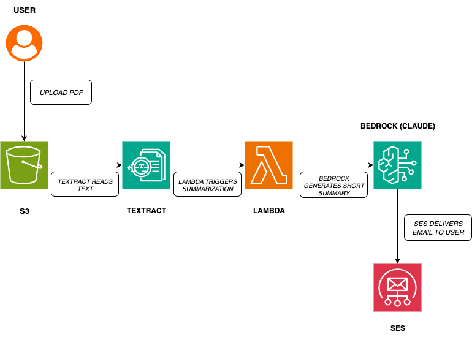

## Problem
Business owners and managers spend hours reading long PDF reports (20–50 pages).  
This is time-consuming and delays decision-making.

## Solution
I created an AI-powered PDF Auto Summarizer using AWS.  

Now, a 20-page report becomes a 5-line email summary — fast, clear, and easy to consume.

## How It Works

1. A long PDF is uploaded into an S3 bucket.  
2. Amazon Textract automatically extracts text from the PDF.  
3. A Lambda function calls Amazon Bedrock (Claude) to generate a short summary.  
4. Amazon SES sends the summary directly to the user’s inbox.  

Result: A long, boring report is now summarized into crisp bullet points.

## 🖼️ Architecture

## Business Impact
- Saves hours of manual reading  
- Helps managers focus on decisions, not documents  
- Easy to integrate in e-commerce, finance, and operations reporting.  

